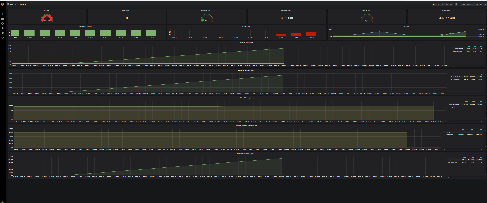
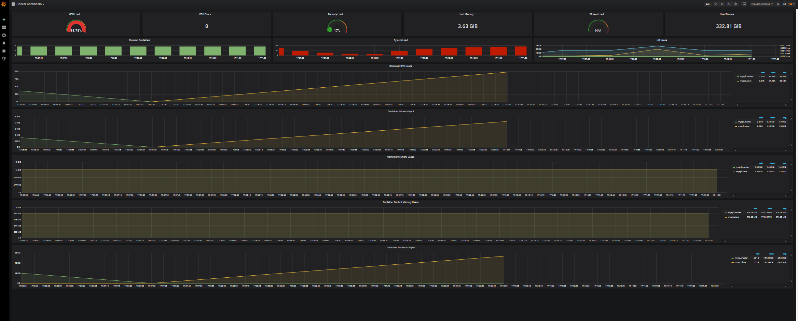

# Домашнее задание: Настройка репликации

## Цель: 
В результате выполнения ДЗ вы настроите репликацию и протестируете ее влияние на производительность системы.   
В данном задании тренируются навыки: 
- администрирование MySQL; 
- настройка репликации; 
- проведение нагрузочных тестов;

1) Настраиваем асинхронную репликацию.
2) Выбираем 2 любых запроса на чтения (в идеале самых частых и тяжелых по логике работы сайта) и переносим их на чтение со слейва.
3) Делаем нагрузочный тест по странице, которую перевели на слейв до и после репликации. Замеряем нагрузку мастера (CPU, la, disc usage, memory usage).
4) ОПЦИОНАЛЬНО: в качестве конфига, который хранит IP реплики сделать массив для легкого добавления реплики. Это не самый правильный способ балансирования нагрузки. Поэтому опционально.

ДЗ принимается в виде исходного кода на github и отчета по выполненной работе.
Критерии оценки: Оценка происходит по принципу зачет/незачет.

Требования:
- В отчете корректно описано, как настроена репликация.
- 2 запроса переведено на чтение со слейва.
- Нагрузочное тестирование показало, что нагрузка перешла на слейв. 

План:
Переделываем сервис
1. В конструктор сервисов доступа добавлен  пераметр, принимающий спиосок строк, содержаших строки соединения срепликами
2. Поднять реплики MySQl
3. Поднять  систему сбора  метрик

## Ответы на Домашнюю работу:

### 1. Создание репликации:
1. Создаем 2 Docker Service mysql_master и mysql_slave на основе базового образа MySQL версии 5.7
2. Устнавливаем на обоих серверах идентичные конфиги для репликации

        MYSQL_USER=mydb_slave_user # Пользователь под кем будет работать репликация
        MYSQL_PASSWORD=mydb_slave_pwd # Пароль пользователя под кем будет работать репликация
        MYSQL_DATABASE=mydb # Имя БД, для репликации

3. Создаем конфигурацию для  mysql_master

        [mysqld]

        skip-host-cache 
        skip-name-resolve

        server-id = 1 # ID  сервера
        log_bin = /var/log/mysql/mysql-bin.log # дирректорий куда будет  записываться binlog
        binlog_format = ROW # Формат бинлога
        binlog_do_db = mydb   # База данных для репликации

4. Создаем конфигурацию для  mysql_slave

        [mysqld]

        skip-host-cache
        skip-name-resolve

        server-id=2  # ID  сервера
        relay-log = /var/log/mysql/mysql-relay-bin.log # Путь к relay логу
        log_bin = /var/log/mysql/mysql-bin.log # Путь к bin логу на Мастере
        binlog_do_db = mydb # База данных для репликации

5. Выдаем права на репликацию пользователю под котормы она будет работать 

        GRANT REPLICATION SLAVE ON *.* TO "mydb_slave_user"@"%" IDENTIFIED BY "mydb_slave_pwd"; FLUSH PRIVILEGES;

6.  Запуск Слейва  

        CHANGE MASTER TO MASTER_HOST='$(docker-ip mysql_master)',MASTER_USER='mydb_slave_user',MASTER_PASSWORD='mydb_slave_pwd',MASTER_LOG_FILE='$CURRENT_LOG',MASTER_LOG_POS=$CURRENT_POS; START SLAVE;

        Где $CURRENT_LOG - идентификатор лога на мастере, от которого требуется накат логов
            $CURRENT_POS - идентифиакатор транзакции для наката 

Статус репликации

Проверить работу репликации на Слейве можно запросом:   

    SHOW SLAVE STATUS\G

### 2 запроса переведено на чтение со слейва:
    1. В конфигурацию  приложения внесен доп опция - строка сеодинения с репликой.
    2. В базовый репозиторий доступа к данным, для запроса, которе только читают,  передается строка с БД, если определена опция подключения к  слейву, то использвется она, иначе строка соединения с мастером.
    3. Доработаны  2 метода сервиса - получение списка анакет и получение списка анкет по фильтру.

###  Нагрузочное тестирование показало, что нагрузка перешла на слейв

Показатели метрик контейнеров до переключения на  реплики  - чтение с мастера  

 

Показатели метрик контейнеров после переключения на  реплики  

  

 Как видно из графиков Graphana  -  утилизация  CPU и сетевой трафик переключился на контейнер со Slave

 ###  Псевдо балансер соединений с БД
  В конфиг  добавлена возвможность указания множеств строк соединений с  БД

        "DB:ConnectionString": "Server=192.168.1.80;Port=4406;Database=mydb;...,
        "DB:ConnectionStringReplicas_0": "Server=192.168.1.80;Port=5506;Database=mydb;..

  В Bootstrap  класс добавнеа обработка до 10 строк реплик и помежение их в  коллекцию 

        var connectionList = new List<string>();

            for (int i =0; i < 10; i++)
            {
                var conRepl = Configuration.GetValue<string>($"DB:ConnectionStringReplicas_{i}");
                if (!string.IsNullOrEmpty(conRepl))
                {
                    connectionList.Add(conRepl);
                }

            }

В Базовом классе  Репозиториев, добавлена случайное выделение строки соединения  

        if (_readOnlyConnList != null && _readOnlyConnList.Any())
                return new MySqlConnection(_readOnlyConnList.Shuffle().First());